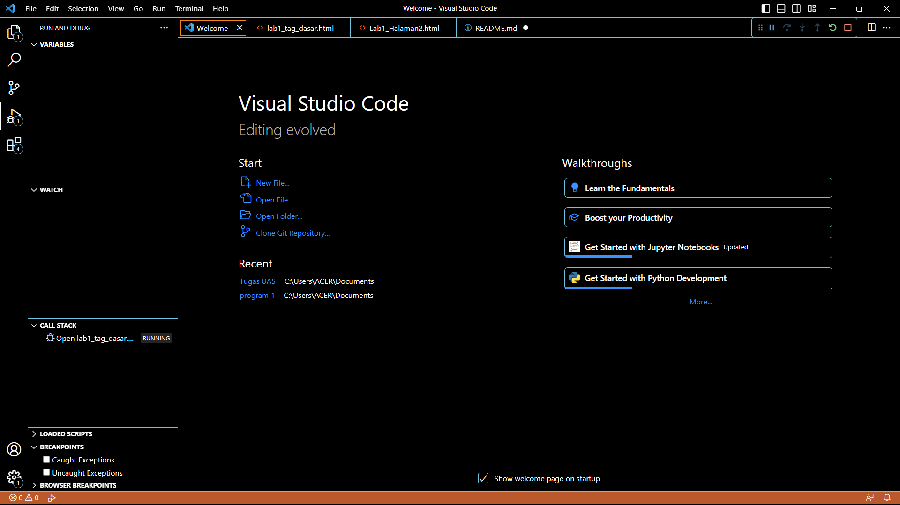
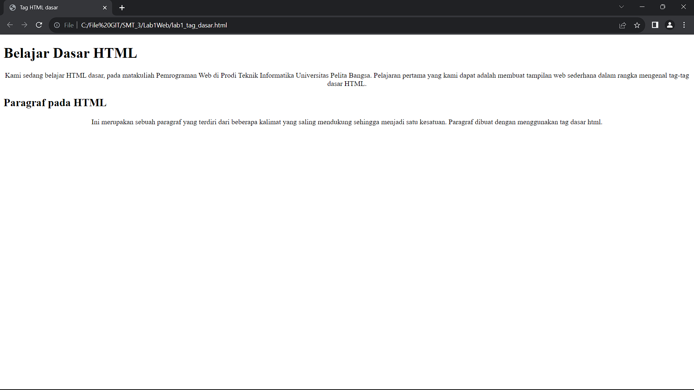
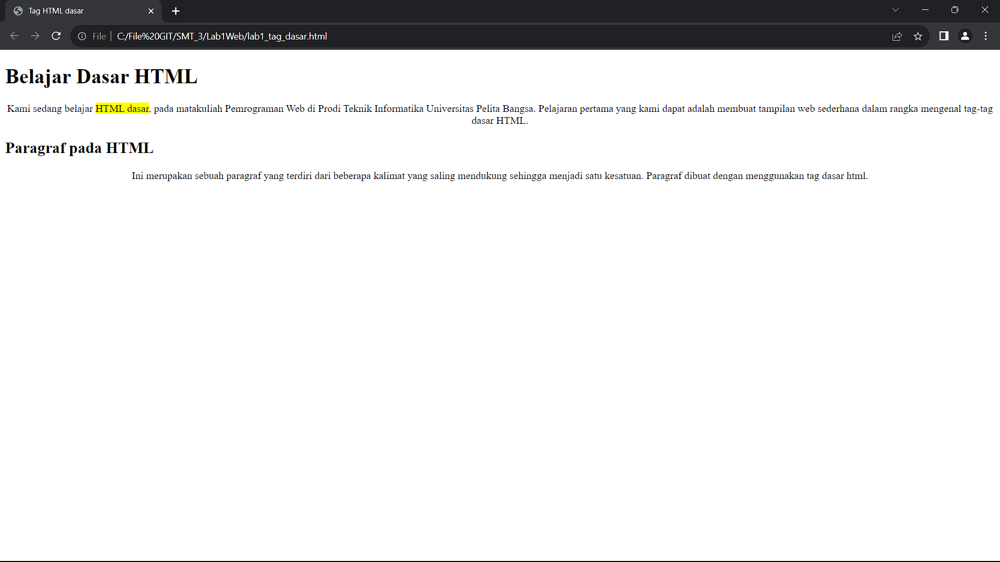

# **Lab 1 Web**

```
Nama    : Fadhlurohman Fatikh Navintino
NIM     : 312210368
Kelas   : TI.22.A4
```

## **Instruksi Praktikum**

1. Persiapkan text editor
2. Buat file baru dengan nama tag_dasar.html
3. Buat struktur dasar dari dokumen HTML
4. Ikuti langkah-langkah praktikum yang akan dijelaskan berikutnya
5. Lakukan validasi dokumen html dengan mengakses http://validator.w3.org

## **Langkah-langkah Praktikum**

1. Buka VSCode


2.buat file dengan nama **lab1_tag_dasar.html**


3. Buatlah struktur dasar HTML

```html
<!DOCTYPE html>
<html lang="en">
  <head>
    <meta charset="UTF-8" />
    <meta name="viewport" content="width=device-width, initial-scale=1.0" />
    <title>Tag HTML dasar</title>
  </head>
  <body></body>
</html>
```

4. buka file dengan web browser


5. Membuat Paragraf

- kita dapat mengubah nilai atributnya (align => justify, left, right, dan center) untuk melihat
  perbedaan lainnya.
  _INPUT_

```html
<!-- paragraf 1 -->
<p align="center">
  Kami sedang belajar HTML dasar, pada matakuliah Pemrograman Web di Prodi
  Teknik Informatika Universitas Pelita Bangsa. Pelajaran pertama yang kami
  dapat adalah membuat tampilan web sederhana dalam rangka mengenal tag-tag
  dasar HTML.
</p>
<!--  paragraf 2 -->
<p align="center">
  Ini merupakan sebuah paragraf yang terdiri dari beberapa kalimat yang saling
  mendukung sehingga menjadi satu kesatuan. Paragraf dibuat dengan menggunakan
  tag dasar html.
</p>
```

_OUTPUT_


6. Menambahkan Judul (h)

   _INPUT_

```html
<!-- judul paragraf 1 -->
<h1>Belajar Dasar HTML</h1>
<!-- paragraf 1 -->
<!-- judul paragraf 2 -->
<h2>Paragraf pada HTML</h2>
<!--  paragraf 2 -->
```

_OUTPUT_


7. Memformat teks

   _INPUT_

```html
<p align="center">
  Kami sedang belajar <mark>HTML dasar</mark>, pada matakuliah
  <b>Pemrograman Web</b>Pemrograman Web di Prodi Teknik Informatika
  <u>Universitas Pelita Bangsa.</u>. Pelajaran pertama yang kami dapat adalah
  membuat tampilan web sederhana dalam rangka mengenal tag-tag dasar HTML.
</p>
```

_OUTPUT_


8. Menambhkan Gambar

   _INPUT_

```html
<!-- judul paragraf 3 -->
<h3>Menambahkan Gambar</h3>

```

_OUTPUT_


9. Menambhkan Link Navigasi

   _INPUT_

   ```html
   <!-- menambahkan link navigasi -->
   <nav>
     <a href="lab1_tag_dasar.html">Dasar HTML</a>
     <a href="lab1_halaman2.html">Halaman 2</a>
     <a href="http://www.google.com">Halaman Web Eksternal Google</a>
   </nav>
   <hr />
   ```

   _OUTPUT_


   
## **Jawab Pertanyaan Berikut**

1. Lakukan perubahan pada kode sesuai dengan keinginan anda, amati perubahannya adakah
   error ketika terjadi kesalahan penulisan tag?  
   **Jawaban:**

   - Tidak ada Error karena jika pada sebuah tag salah maka tidak akan ditampilkan

2. Apa perbedaan dari tag p dengan tag br, berikan penjelasannya!  
   **Jawaban:**

   - Tag p untuk membuat paragraf,tag br untuk memberikan enter pada paragraf.

3. Apa perbedaan atribut title dan alt pada tag img, berikan penjelasannya!  
   **Jawaban:**
   - tag img elemen HTML yang digunakan untuk memberikan informasi tentang gambar.Atribut alt digunakan untuk memberikan teks alternatif yang akan muncul jika gambar tidak dapat ditampilkan.Atribut title digunakan untuk memberikan judul atau keterangan tambahan yang akan muncul saat pengguna mengarahkan kursor mouse ke gambar.

   - Untuk mengatur ukuran gambar, digunakan atribut width dan height. Agar tampilan gambar proporsional sebaiknya kedua atribut tersebut diisi semua atau tidak? Berikan penjelasannya!        
   **Jawaban:** 
   - sebaiknya di isi semua, Jika Anda mengisi kedua atribut width dan height dengan nilai yang tepat, gambar akan ditampilkan dengan ukuran yang sesuai. Ini akan mempertahankan proporsionalitas gambar, dengan nilai yg sesuai dengan aspek rasio dari gambar

   
5. Pada link tambahkan atribut target dengan nilai atribut bervariasi ( \_blank, \_self, \_top,
\_parent ), apa yang terjadi pada masing-masing nilai antribut tersebut?  
**Jawaban:** 
   - blank:
Jika Anda mengatur atribut target="_blank", tautan akan dibuka dalam tab atau jendela baru, tergantung pada konfigurasi browser pengguna.
   - self:
Atribut target="_self" adalah nilai default untuk atribut target. Ini mengarahkan tautan untuk dibuka dalam jendela atau tab saat ini.
   - top:
Ketika Anda mengatur atribut target="_top", tautan akan membuka halaman yang ditautkan dalam jendela atau tab yang sama seperti blank.
   - parent:
Atribut target="_parent" digunakan ketika halaman web Anda terdiri dari bingkai (frame).